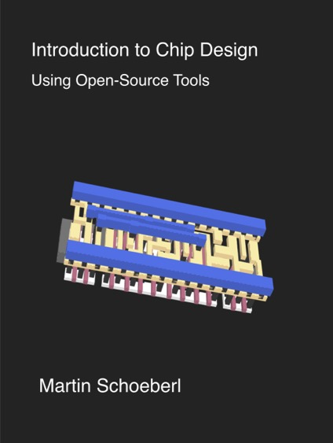

# Introduction to Chip Design
## Using Open-Source Tools

This eBook is an introduction to chip design for a Bachelor level class.
The practical labs focus on using open-source tools only.
This enables the students to explore and tinker in chip design on their own laptops.

Find a PDF of this book at [Chip Design Book](https://www.imm.dtu.dk/~masca/chip-design-book.html)

[](https://www.imm.dtu.dk/~masca/chip-design-book.html)

Cite this book as:
```
@Book{chip:design:book,
  author       = {Martin Schoeberl},
  title        = {Introduction to Chip Design Using Open-Source Tools},
  year         = {2025},
  howpublished = {\url{https://www.imm.dtu.dk/~masca/chip-design-book.html}},
}
```